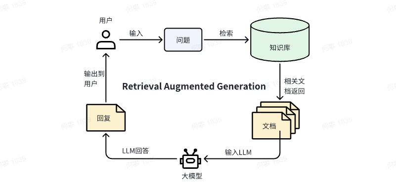

**Build-your-own-domain-RAG-base-Milvus**
# **Build-your-own-domain-RAG-base-Milvus**
> 如何基于milvus构建垂域RAG；垂域RAG可以做哪些优化；垂域RAG优化流程

# 更新说明
> 建立更新说明，以便查看更新内容

* 更新了由文档抽取Query的代码和脚本，为后续训练检索模型构建训练集:*Build-your-own-domain-RAG-base-Milvus\project\extract_query_from_document.sh*


# **使用milvus框架构建垂域RAG应用**
> 下面介绍RAG的原理和优化措施，直接开始构建Chatbot可以转到[AI菜谱-神厨小福贵](project/README.md)

## **背景**
*简要介绍RAG的使用背景，熟悉这部分内容的可以跳过*

RAG（Retrieval Augmentation Generation），中文叫检索增强生成。RAG的详细介绍会在后续的内容。

### **为什么需要RAG？**
从ChatGPT问世以来，LLM百花齐放，通用模型已经具备丰富的背景知识（Trillion级别的语料的预训练和微调）以及数十万、百万级别的输入序列长度支持。那么我们为什么还需要RAG呢？无非以下几点：

1. 模型知识库有限\\
LLM的训练时间跨度是非常长的，训练通常花费非常大的计算资源和计算时间。在训练启动前，就需要准备好相关的语料（清洗、去重、数据配比、Instruction数据构建、Reward数据等等），所以模型通过训练学习到的知识无法做到实时的更新。因此诸如垂域文档（产品手册、公司制度手册、作家新写的小说等等），考虑到实时性和保密性，对于任何一个模型内部而言这些知识都是不具备的，并且对通用模型做二次训练也是不现实的。
2. 超长的序列长度造成的时延消耗和性能损失\\
首先，由于LLM基于transformers的attention机制，越长的序列长度会带来更多的计算量。尽管有一些attention机制的优化，例如GQA，但是也是有非常大的计算量。因此推理长序列具有非常大的时间消耗。
同时根据scaling laws定律，只有更大参数的LLM才能实现更好的长序列理解性能，进一步的造成了时间的消耗。\\
众多的LLM宣传自己模型具有非常好的长序列理解能力，同时也拿出了很多探针实验（大海捞针）做出证明，但是除了时延之外，长序列理解还有很长的路要走。
“探针实验有一定bug。其实相当于测试模型的查询功能。可以理解为训练SPLADE稀疏向量，attention只需要学习到位于不同位置的相同的词语的权重即可，但是距离真正的长序列理解还有一定距离。”

RAG能够构建灵活的知识库，这个知识库是可以编辑、可动态更新的，属于模型的外部知识。这部分知识可以进行灵活的维护，因此RAG能够非常好地解决了第一个问题。部分情况下，回答问题往往并不需要全部的文档，只需要特定相关的文档即可。如果把全部的文档作为知识，那么长序列中的其他无关干扰信息，无疑会对LLM回答进行影响。因此RAG能够一定程度上缓解长序列的问题，其中时延问题也非常好的结果。对于效果部分，RAG的召回文档可能不够全面（召回失败、抽象和概要性问题等等），但是这部分问题从原来针对LLM模型优化（跨度长、成本高）的问题变成优化检索模型和LLM。成本大大降低，优化方式也更加灵活。

综上，目前RAG能够解决非常多的问题，RAG的风靡也促就了非常多的框架对RAG的支持，例如langchain、ollama、milvus等等。对于新学习RAG的人来说，是一个非常好的消息，学习成本大大降低。部分框架只需要几十行代码即可完成简易RAG系统的构建。


### **为什么需要垂域RAG？**

#### **1. 业务场景需要**
由于RAG能够时延较低、幻觉较少、对话流畅的特点，得到了非常广的应用，例如智能客服、智能问答、搜索引擎、智能助手等等的应用。概要地说，凡是具备私域文档，都可以按照要求构建RAG系统应用。

#### **2. 检索模型和LLM垂域性能不足**
在“为什么需要RAG？”里面提到了通用LLM在不少垂域上的理解是有待提升的，因此可以基于垂域文档外部知识对LLM进行补充。然而，尽管有了外部知识的补充，对于一些复杂、陌生、抽象的概念理解也是不足够的，也存在不小的幻觉。这种情况下，就需要对LLM进行增强训练。
同样的情况，检索模型也需要在垂域上进行增强训练才能达到更好的效果。

## **垂域RAG**
不管RAG技术如何迭代，无论是朴素RAG还是hybrid-RAG、GraphRAG和meta-RAG，无非都分为三个部分：知识库、检索、问答。区别在于各种方法在各个板块的措施不太一样。例如graphRAG引入了知识图谱，构建了Local search和Global search。所以，无论多复杂的RAG系统都可以用上述几个过程来描述。

考虑到垂域RAG的性能优化，我们将垂域RAG的分为下面五大板块，每一个板块涉及到了不少的优化措施。

### **一、知识库构建**
> 知识库内容是模型生成回答的参考依据，但是往往是在RAG运用当中最容易被忽视的部分。不少人请倾向于怎么把检索模型训练好和调整问答模型的Prompt，但忘记了知识库的重要性。一个好的知识库，逻辑清晰、结构明了的内容对于检索向量的转化和模型对知识的理解，都起到了至关重要的作用。

#### 1. **知识点的拆分**
假设一个RAG任务中，收到了业务方给到的若干个文档（本文不讨论word、PDF格式文档的解析，日后有空补全），假设都是markdown格式的文档。由于多数情况下，文档内容都是较长的，因此我们需要对文档进行拆分，拆分为一个个较为独立的知识。现在问题变成了，我们如何对若干个较长的文档拆分为合格、较为优质的知识点呢？
*   **步骤1：基于规则粗拆**
  首先，拿到文档，可以对文档的结构和内容进行初步的分析。考虑到文档的多样性，一般来说，一个文档为了保证可读性，都会进行分章节、分标题的撰写。那么可以通过分析文档的结构特点，按照粒度较大的原则，设置一点的拆分规则，将长文档按照章节、标题、page等等拆分为粒度较大、知识独立的板块。
*   **步骤2：基于LLM理解拆分**
  规则拆分，粒度大一点可以保证知识块的独立和完整，不会破坏上下文的连贯性。但是再细致一点就不行了，规则很难涵盖多种情况，导致拆分错误率的增加。在这里可以基于LLM的理解能力去进一步拆分知识点。得到步骤1粒度较大的知识点后，可以给LLM设置特点的prompt，让大模型去判断知识点拆分的位置。这里推荐一个github项目，对文档的滑动窗口和prompt构建都具有不错的参考：https://github.com/joaodsmarques/LumberChunker
#### 2. **知识点的补全**
由于人阅读习惯，或者说编写文档的习惯，一个大标题下通过会包含了多个小标题及对应的内容（例如本文档）。在对文档进行知识点进行拆分的时候，不少上层标题的信息就被丢失掉了。由于不少的文档有很多看起来相似的内容相似的概念，但是属于不同的章节。为了保证拆分知识点的完整性，我们需要对知识点进行补全。
根据知识点的拆分方法，也可以从两个方面去对知识点进行补全：
*   规则拆分保留上层标题对下层内容进行标题补全
  对于markdown文档来说，标题都有特殊的表示，例如“# ## ### ...”分别对应一级到三级标题，因此在规则拆分的时候可以保留对应的层级标题信息，然后把标题补全到规则拆分和LLM拆分的知识点中。
*   基于LLM结合上下文进行补全
  结合规则拆分保存的层级标题，对知识点进行改写补充。例如：
  拆分知识点：“知识点补全：XXX” ；补全知识点：“*知识库构建的过程中，包含了知识点的补全：XXX”*
#### 3. **知识点的QC**
基于规则和LLM的拆分补全后，难免出现部分知识点构建不够好的情况。为了进一步完善知识库的构建，需要对构建的知识库进行QC。QC的方式分为自动和人工。
*   自动方式，即把QC任务交给LLM，设置多组示例，让LLM通过In Context Learning学习示例case，对每个知识点进行打分，然后得到多组打分数据取平均值，通过分数粗筛不合格的知识点。
*   人工方式，即通过人工复查的方式对知识点进行QC。在文档较小或者标注人员足够的情况，可以选择这种方式。
#### 4. **补充知识库**
一些概述性问题“《三体》主要讲的是什么？”、“描述一下章北海的变化历程”，以及一些流程操作路径问题“怎么用剪映实现渐变功能”等等，普通的知识库是无法支持检索到这类问题的相关知识的。
为了实现更好的RAG问答效果，也结合前沿的RAG技术，在文档满足的前提下，可以构建额外的补充知识库。
这里给出两个补充知识库的示例，补充知识库不一定在所有的场景下都适用，但是可以为其他场景构建更加完善的知识提供一定的参考和思路。
*   知识图谱
  参考GraphRAG的思路，基于LLM提取知识库中的实体信息（实体描述、实体关系），并将同一实体的描述总结生成描述摘要，可以一定程度上实现全局搜索的功能。进一步地，可以根据抽取的实体和关系，构建社群和层级关系，进一步的优化全局搜索的性能。
*   层级知识库
  假设有针对“剪映”构建RAG问答，剪映APP包含很多复杂的剪辑编辑功能，假设拥有对应的使用指南知识库：该知识库包含了所有剪映的功能描述，各种功能入口等等信息，十分的错综复杂。如果只是简单的构建知识库，那么针对复杂流程问题，询问执行路径是很难使用基础的知识库进行检索的。除了上述提到的知识图谱结构，还可以建立层级知识库。
  层级知识库的meta单元如下面结构：

```python
"""
功能描述：为视频添加蒙版操作
功能路径：
{
  "一级功能":"轨道轴",  
  "二级功能":"视频片段",  
  "三级功能":"工具栏",  
  "四级功能":"添加蒙版"
}"""
```

  其中“功能描述”是根据下面的功能路径，依靠LLM自动生成功能描述摘要，该部分文本内容用于后续检索模型转化为向量进行匹配。若检索到该单元，则把该meta单元作为知识输入到模型。换句话说，功能描述只用于检索，描述和路径的json用于输入LLM进行回答。

  得到所有终端功能的meta单元知识点后（可以理解为叶子节点，不再具有更加细化的功能），需要从底部到顶部进行逐级的摘要总结，进而得到那些上层功能的摘要描述文本。例如，对于上述知识点中三级功能**“工具栏”**有如下3个四级子功能“添加蒙版、文字和音量调节”。

```python
"""
功能描述：为视频添加蒙版操作
功能路径：{
  "一级功能":"轨道轴",  
  "二级功能":"视频片段",  
  "三级功能":"工具栏",  
  "四级功能":"添加蒙版"
}

功能描述：为视频添加文字操作
功能路径：
{
  "一级功能":"轨道轴",  
  "二级功能":"视频片段",  
  "三级功能":"工具栏",  
  "四级功能":"文字"
}

功能描述：调节视频音量
功能路径：{
  "一级功能":"轨道轴",  
  "二级功能":"视频片段",  
  "三级功能":"工具栏",  
  "四级功能":"音量调节"
}"""
```
那对三级功能**“工具栏”**进行摘要总结得到的概要上层meta知识点为
```python
"""
功能描述：使用工具栏对视频片段进行编辑，包含蒙版、文字和音量等操作
功能路径：
{
  "一级功能":"轨道轴",  
  "二级功能":"视频片段",  
  "三级功能":"工具栏"
}
"""
```

  通过层级知识库的构建，不仅能够获得每一级功能的描述作为检索，同时还包含了对应的访问执行路径，可以进一步的降低后续问答LLM出错的可能性，降低幻觉概率。
### **二、Query理解**
真实场景下，不同用户提问习惯非常地不一样。有的用户倾向于非常简单的提问，有的用户则倾向于输入非常复杂的提问。
在第一种情况下，用户提问通常需要结合上下文进行理解，如果仅仅用用户当前提问进行检索，就无法查询得到相关的文档。因此需要结合上下文，对用户的提问进行限定条件的补全，例如时间、地点、主体、状态等等信息。
对于第二种情况，用户输入问题非常复杂，修饰词比较多，可能涉及多个提问意图。因此需要对用户的query进行拆解。
因此，在RAG中，对用户输入的query进行理解，从而在检索阶段能够得到更好的相关文档，同时也促进问答LLM的理解。对query的理解本文分为了两个方面：query改写和消歧。
#### 1. **query改写**
query的改写，是对用户的输入的query进行恰当地改写，让提问变得更加完整和清晰。更加准确的query能够获得更好的文档召回效果，更好地定位用户提问的意图。
##### query补全
  在有上下文的情况下，用户当前提问倾向省略部分限定条件，例如Q1：今天天气怎么样；Q2：那明天呢。对于Q2来说，完整的提问应该是Q2：明天的天气怎么样？因此，需要结合上下文的内容，对用户输入query进行补全，补全对应的上下文限定条件：时间、地点、主体、事件等等，进而得到一个完整的query用于后续文档的检索。
  query补全的方式，最简单的方式可以基于LLM实现，即构建一段prompt，让LLM结合历史对话和用户当前对话进行补全。例如，给出下面示例prompt。
```python
"""
--任务--在多轮对话任务中，对用户输入的问题进行准确理解是非常重要的。你需要完成在多轮对话中Query改写的任务，请结合对话历史上下文内容准确识别用户意图，对当前Query进行省略补全，让query更清晰和完整。

--对话历史上下文说明--
《描述该对话发生在什么应用场景，能够使得LLM对query的补全更加准确》

--要求--
1.首先判断query是否需要进行改写，若为打招呼、结束语等无需改写。直接输出无需改写
2.改写后的query不能发生语义和者意图改变
3.结合对话历史上下文，对query进行完善和补全，补全缺失的主体（人物、组织等）和情景（地点、时间和事件等等）
4.信息增量确保在合适的范围，不要增添过于冗余的信息--输出格式--直接输出改写后的query。若不需改写，直接输出原始query。

--示例输入与输出--
示例1
##对话历史：
Q：介绍一下XX公司
A：XX公司是一家成立于2018年的AI虚拟人公司...

输入：招人吗
输出：XX公司还在招聘吗？

示例2
##对话历史：
Q：公司周边有什么餐厅吗
A：是的，公司附近有很多美食餐厅，包括...

输入：外卖可以吗？
输出：请问公司周边的餐厅可以点外卖吗？

--输入--
##对话历史:{}

输入：{}

输出：
"""
```

但是，并不是一切都随着我们想要的方向走的。query补全的时候，通常会出现两个问题：
- 上下文补全的内容太多，过度冗余，反而导致补全后的query中原始的真实意图文本被忽略，其他条件信息占多数，进而造成检索出现偏差。
- 补全信息出现错误，即LLM无法理解query目的，增添了其他无关上下文信息，导致检索错误。

另外，由于query补全，需要调用LLM生成对应的refined query后，再用于检索，所以使用流式生成。换句话说，在LLM没有生成完refined query之前，无法进行检索和问答，并且随着对话轮次的增加，上下文内容逐渐变长，LLM返回refined query的时间是不断增加。

尽管，基于query的补全有不少缺点，但是这一步用于更准确的理解用户提问是非常有必要的。面对query补全的效果和时延，可以做出其他的优化措施。本文提供以下两点建议：
- 效果提升：模型训练+过滤。可以构造query补全数据集，对LLM进行训练。同时对补全后的query作一个筛选策略，使用rerank模型，对生成补全的query和原始query计算相关分数，设置阈值，过滤到严重错误的case。
- 时延降低：降低query补全LLM的参数量，使用更小的模型做该任务。对于query 补全来说，难度比问答相比较小，因此可以使用更小的模型进行训练，并且搭配加速模型推理框架，进而降低query补全的时延。
  
##### query拆解
复杂场景下，用户为了描述一个具体情况下的具体问题，会尽可能地全面描述输入的问题，例如“四位面壁者中，其他三位面壁者都是怎么被破壁的？为什么只有罗辑能够成功？成功的因素是什么？”。这样的一个问题包含多方面的信息，需要召回很大的文档。但是这个问题包含了非常多的信息，如果只用单纯的将问题转化为稠密和稀疏向量，那是无法得到较好的召回的效果的。因此需要将这部分的问题进行拆解，拆解为更为清晰的多个问题。例如，上述问题可拆解为：1.四位面壁者都有谁？；2.四位面壁者的面壁策略？3.三体应对面壁者的破壁计划？；4.罗辑的面壁者计划是什么？

以下是两种query拆解的方式：
- 规则拆解：规则拆解很简单，使用场景的标点符号（句号、问号、感叹号等等）进行拆分。该方法的优点是速度快，几乎没有时延；缺点是拆解结果存在误差，没有上下文，例如“成功的因素是什么？”正确指代的应该是罗辑的面壁者计划成功的因素。
- LLM大模型拆解：和query补全一样，设置prompt使用大模型对问题进行拆分，让LLM返回格式化的拆解问题。该方法的好处是能够有语义上的理解，拆解结果更加的准确；缺点是，调用LLM大模型会耗费时间
**query拆解和query的补全都可以调用LLM完成，如果两个任务分别调用LLM，则会增加两倍的时延，因此可将query的补全和拆解设置一个共同的prompt，只需要一次调用，即可返回最终的query改写结果。**

**Query改写prompt**
```python
"""
任务：输入对话历史上文history和当前提问query，你需要按照要求对query进行补全和拆解，输出改写后的query。

问题改写类型：
1.拆解：当query含义复杂，范围较广，可以拆分为多个意图更清晰的sub-query。
2.补全：query简单，需要结合上下文进行理解，需要对query进行信息补全（时间、地点、主体信息等等补全）。
3.无需改写：若query为打招呼、结束语、有害问题或者已完整清晰的问题则无需改写。

要求：
1.拆解query不能改变问题意图；
2.补全query不要增加冗余的信息，要保证补全信息合理；

输出格式：
-首先输出开始符<start>
-输出拆解或者补全的问题。序号.问题？[改写类型(拆解、补全和无需改写)：理由说明]
-结尾输出结束符<end>

示例：
输入：
对话历史history：
Q：介绍一下XX公司
A：XX公司是一家成立于2018年的AI虚拟人公司...

当前提问query：招人吗

输出：
<start>
1.XX公司还在招聘吗？[补全：补全公司名称让意图更为清晰]
<end>

输入：
对话历史history：
Q：北京有什么好玩的？
A：北京是中国的首都，也是明清古朝的首都...

当前提问query：哪些景点是必去的？另外有什么美食吗

输出：
<start>
1.北京有哪些必去景点呢？[拆解：询问北京有哪些景点]
2.北京有哪些美食？[拆解：询问北京有哪些美食]
<end>

输入：
对话历史history：无

当前提问query：你好呀

输出：
<start>
1.你好呀[无需改写：打招呼用语，无需改写]
<end>

输入：对话历史history：{}

当前提问query：{}

输出：
"""
```
备注：
1. 待LLM输出改写（补全或拆解）的结果后，可以用正则表达式抽取改写结果，包装了改写的稳定性
2. 让LLM说明原因会是的结果更为准确


#### 2. **query消歧**
未实现，待补充ing

#### 3. **query改写安全性**
在基于LLM对query进行改写时，需要考虑到对抗性的问题输入，即有害内容或者无意义内容的输入。如果面对这类输入，对query的改写干扰较大，会出现不满足要求的错误输出。造成无法正常改写query的原因如下：
  LLM具有安全性，对抗输出，输出安全性回复，改写无效。
  LLM对后续query的改写受到前面有害query的影响，导致后续query改写无效
因此，基于LLM对query进行改写时，需要考虑较为完备的安全性策略，如果检测到对抗性输入，应该增加输出限定，例如“敏感内容”，后续问答流程逻辑中，如果出现了“敏感内容”，应该在后续对话种删除对应干扰信息。
### **三、文档检索**
文档检索的过程是使用用户输入的问题和上下文，检索出对应的相关文档。文档的检索可以分为如下几种优化方法，每种方法对应了不同的优化方向。
总的来说，文档检索流程就是：
   建立文档和向量的映射关系；
  基于向量和距离度量指标（内积、余弦相似度、相关系数等）进行检索；
  按照分数结果倒序排名，由高往低的去除对应的文档。
步骤a也是构建知识库的过程，但是涉及到检索优化，因此把这部分归类到文档检索进行描述。
#### 1. **向量和文档的映射**
向量和文档的映射可以用一张表格说明：
|序号|检索文本|检索文本-类型|检索向量|知识点|
|---|---|---|---|---|
|1|# 西红柿鸡蛋汤 ## 操作1. 将西红柿洗净，切块。2. 葱姜蒜切碎。3. 鸡蛋打到碗中，用筷子（或打蛋器）搅拌均匀。4. 热锅，并放入 15 毫升的油，待能从油中看到冒出一丝烟时，放入葱姜蒜翻炒 30 秒。|chunk-1|[0.1245, 0.3677, 0.9021, 0.3019, 0.4394, 0.0714, 0.4484, 0.5045]|# 西红柿鸡蛋汤 ## 操作1. 将西红柿洗净，切块。2. 葱姜蒜切碎。3. 鸡蛋打到碗中，用筷子（或打蛋器）搅拌均匀。4. 热锅，并放入 15 毫升的油，待能从油中看到冒出一丝烟时，放入葱姜蒜翻炒 30 秒。5. 放入西红柿翻炒 1 分钟。6. 倒入水，水的高度大约为锅内菜品高度的 1.2 倍，并放入盐。7. 待开锅后，将鸡蛋液放入，并用筷子将鸡蛋打散，放入味素和香油。8. 等待 30 秒，关火出锅。|
|2|5. 放入西红柿翻炒 1 分钟。6. 倒入水，水的高度大约为锅内菜品高度的 1.2 倍，并放入盐。7. 待开锅后，将鸡蛋液放入，并用筷子将鸡蛋打散，放入味素和香油。8. 等待 30 秒，关火出锅。|chunk-2|[0.4544, 0.0079, 0.6594, 0.7154, 0.5299, 0.8568, 0.5065, 0.6144]|# 西红柿鸡蛋汤 ## 操作1. 将西红柿洗净，切块。2. 葱姜蒜切碎。3. 鸡蛋打到碗中，用筷子（或打蛋器）搅拌均匀。4. 热锅，并放入 15 毫升的油，待能从油中看到冒出一丝烟时，放入葱姜蒜翻炒 30 秒。|chunk-1|[0.1245, 0.3677, 0.9021, 0.3019, 0.4394, 0.0714, 0.4484, 0.5045]|# 西红柿鸡蛋汤 ## 操作1. 将西红柿洗净，切块。2. 葱姜蒜切碎。3. 鸡蛋打到碗中，用筷子（或打蛋器）搅拌均匀。4. 热锅，并放入 15 毫升的油，待能从油中看到冒出一丝烟时，放入葱姜蒜翻炒 30 秒。5. 放入西红柿翻炒 1 分钟。6. 倒入水，水的高度大约为锅内菜品高度的 1.2 倍，并放入盐。7. 待开锅后，将鸡蛋液放入，并用筷子将鸡蛋打散，放入味素和香油。8. 等待 30 秒，关火出锅。|
|3|西红柿鸡蛋汤的操作步骤|标题|[0.1744, 0.9765, 0.9498, 0.9731, 0.5622, 0.4062, 0.4986, 0.0459]|# 西红柿鸡蛋汤 ## 操作1. 将西红柿洗净，切块。2. 葱姜蒜切碎。3. 鸡蛋打到碗中，用筷子（或打蛋器）搅拌均匀。4. 热锅，并放入 15 毫升的油，待能从油中看到冒出一丝烟时，放入葱姜蒜翻炒 30 秒。|chunk-1|[0.1245, 0.3677, 0.9021, 0.3019, 0.4394, 0.0714, 0.4484, 0.5045]|# 西红柿鸡蛋汤 ## 操作1. 将西红柿洗净，切块。2. 葱姜蒜切碎。3. 鸡蛋打到碗中，用筷子（或打蛋器）搅拌均匀。4. 热锅，并放入 15 毫升的油，待能从油中看到冒出一丝烟时，放入葱姜蒜翻炒 30 秒。5. 放入西红柿翻炒 1 分钟。6. 倒入水，水的高度大约为锅内菜品高度的 1.2 倍，并放入盐。7. 待开锅后，将鸡蛋液放入，并用筷子将鸡蛋打散，放入味素和香油。8. 等待 30 秒，关火出锅。|
|4|详细介绍了做西红柿鸡蛋汤的详细步骤，也包含了对应的原材料|摘要|[0.1245, 0.3677, 0.9021, 0.3019, 0.4394, 0.0714, 0.4484, 0.5045]|# 西红柿鸡蛋汤 ## 操作1. 将西红柿洗净，切块。2. 葱姜蒜切碎。3. 鸡蛋打到碗中，用筷子（或打蛋器）搅拌均匀。4. 热锅，并放入 15 毫升的油，待能从油中看到冒出一丝烟时，放入葱姜蒜翻炒 30 秒。|chunk-1|[0.1245, 0.3677, 0.9021, 0.3019, 0.4394, 0.0714, 0.4484, 0.5045]|# 西红柿鸡蛋汤 ## 操作1. 将西红柿洗净，切块。2. 葱姜蒜切碎。3. 鸡蛋打到碗中，用筷子（或打蛋器）搅拌均匀。4. 热锅，并放入 15 毫升的油，待能从油中看到冒出一丝烟时，放入葱姜蒜翻炒 30 秒。5. 放入西红柿翻炒 1 分钟。6. 倒入水，水的高度大约为锅内菜品高度的 1.2 倍，并放入盐。7. 待开锅后，将鸡蛋液放入，并用筷子将鸡蛋打散，放入味素和香油。8. 等待 30 秒，关火出锅。|

注意：检索向量由检索文本使用向量化模型得到，而不是由知识点得到
从上述表格可以看出，检索向量（文本）和知识点是多对一的关系。这样做的目的是，通过多个检索文本和用户问题进行匹配，能够增强检索文档的相关性和准确性。
#### 2. **稀疏向量检索**
稀疏向量的检索是一种很普遍基础的算法，运用到众多搜索任务当中（搜索引擎、论文搜索等）。稀疏向量包含了非常多的算法，这里主要列举效果较好、运用较广的算法。
  bm25算法：bm25算法不仅具有TF-IDF的优点，还考虑了文档长度的因素。是一种非常实用的检索算法。但bm25算法的基础应该是考虑上下文的，因此输入的问题需要进行query的改写，同时还要针对上下文进行优化。一种考虑上下文的bm25算法：在计算bm25相关分数的时候，结合所有上文输入的问题，并按照衰减函数设置权重因子，即消息越远的提问，权重越小。
  SPLADE：这是一种使用稠密向量化模型构建稀疏向量的方法，该方法考虑了语义，单独相比较于bm25算法而言，效果更好。但是SPLADE稀疏向量和稠密向量具有一定重复性，因此如果使用hybrid search，更适合使用bm25算法。
#### 3. **稠密向量检索**
稠密向量检索，即使用encoder模型对文本进行编码，输出固定维度的稠密向量。稠密向量检索时，只需要通过距离度量指标计算向量之间的距离，即可得到相关的文档。
稠密向量模型的选择有很多种选择，分别开源模型和闭源模型。首先最常用的开源模型：例如m3e和bge，其中bge模型是智源训练的高质量向量化模型，包含了中文和英文的独立版本以及多语种版本，并且具有不同参数量的版本，选择较为灵活。闭源模型代表性的为openai的embedding模型。
无论是开源还是闭源模型，向量化模型都是基于通用领域的文本进行训练的（涵盖了多个领域的训练数据）。但在垂域场景下，文本通常和通用场景具有一定的区别，因此性能在垂域场景通常不能满足实际需求，需要对向量化模型进行训练，因此开源模型成为了首要选择。
##### **向量模型的训练**
  训练数据准备
  向量化模型是将文本合理的映射到向量空间，影响后续的检索召回性能。但是我们没有合适的方法告诉模型映射出来的向量的好坏。换一种思路，相匹配的文本的向量距离应该近，不匹配应该远，我们就可以把优化向量化表示的过程转化为优化匹配和不配文本之间的距离关系问题。因此检索模型每条训练数据应该由三部分构成：问题、匹配正样本、不匹配的负样本。
  训练数据构造提供两种方法：1. 基于LLM全自动构建。步骤一：把知识点输入到LLM，基于LLM提取query；步骤二：将知识点和抽取的query输入到LLM，基于LLM对query生成的质量进行打分，做出筛选。通过LLM抽取可以获得query和知识点的正样本数据。负样本数据构造比较灵活，可根据实际的场景设置负样本和hard sample。2. 人工构造训练数据。FAQ数据就是天然的正样本数据，query和答案是对应的。但是FAQ的答案风格和知识点的风格可能不太一致，FAQ较口语化，知识点较为结构和书面化。可以基于LLM对FAQ中的A进行改写，改写为对应的知识点风格文本。
  训练loss
  常见的向量化模型训练loss：1. infoNCE，对比学习常见loss；2. Margin loss
  有句话说，向量化模型的训练是样本构造的艺术，更多的工作应该是放在样本的构建上，需要让模型指导哪些是好的，哪些是不好的，才能达到更好的性能。
#### 4. **文档重排**
文档重排也是一个非常重要的过程，能够对召回的文档做进一步的精排。向量化模型只是将文本映射为向量，无论是query还是检索文本都是单独送入模型，其中的注意力无法计算到query和检索文本。而重排模型正好解决了这个问题。重排模型是把query和检索文本一起输入重排模型，最终输出相关性分数。重排模型能够通过注意力记住，同时考虑query和相关文档。
根据部分学者指出，在RAG中，相关文档的排序在prompt中的顺序对模型回答的质量也有一定的影响。这篇论文支持，最相关的文档处于首要位置能够获得更好的问答效果，同时给相关文档中加入一些无关文档，反而具有一定的积极作用。一般来说，选择10篇相关文档送入LLM中进行回答是比较均衡的，但是10篇文档中并非所有文档都和问题有关，如果对文档进行重排，正好对应了上述论文的结论。
### **四、模型问答**
上一部分提到，开源的通用的向量化需要在垂域训练数据上进行训练才能得到更好的效果。对于问答LLM而言，也是同样的道理，如果垂域文本较为小众（新概念、新流程、新问题等等），那只使用通用的模型难以获得较好问答效果。
另外，众所周知，LLM的参数量非常影响模型的问答性能。更大的参数量，具有更好的指令遵循能力，也能够获得更好的问答效果。但是在实际部署的情况下，考虑到时延和部署成本，很少情况下能够部署较大的模型。那如何既有较大模型的问答能力，又能减少模型的参数量呢？
考虑上述两个问题，本文提出了一种垂域问答优化方法。
#### 1. **训练数据构造**
#### 2. **模型训练**
### **五、输出后处理**
在“query改写安全性”部分提到，可能会受到对抗性输入的干扰，模型需要保证生成安全性的回复。在保证安全性回复的同时，如果后续正常提问，可能发生由于前面有害内容的干扰，导致LLM不断生成安全性回复，进入循环，导致无法正常回答。因此需要对回复进行监测，如果触发了安全性回复，应该把还有提问和回复进行删除，避免对后续安全性回答的干扰。

