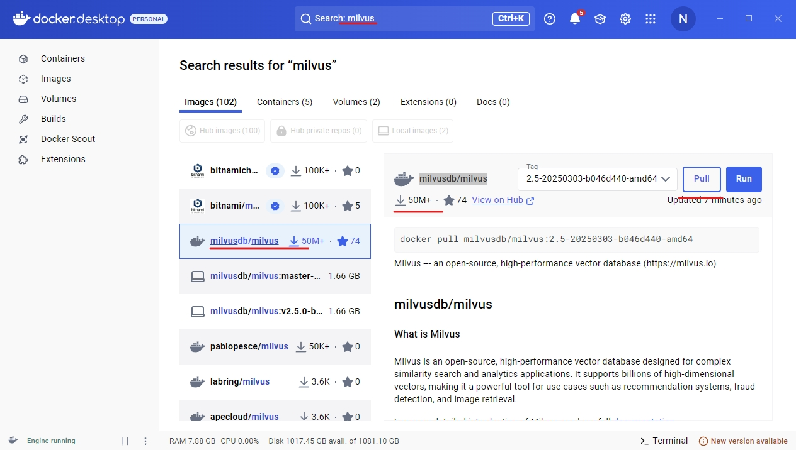
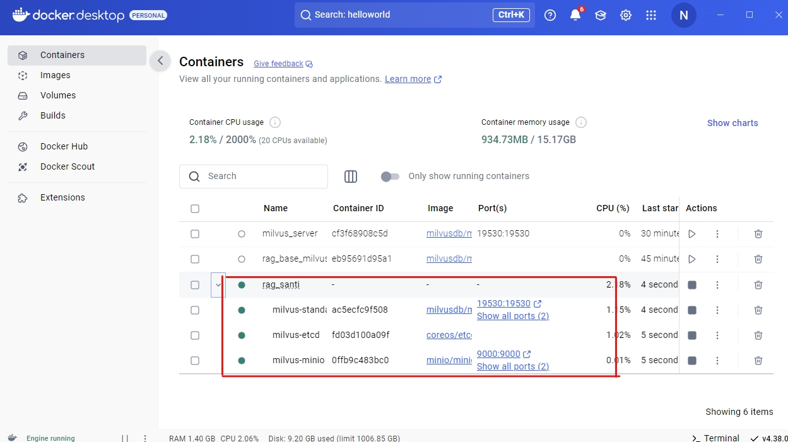

# 基于Milvus构造菜谱小助手-神厨小福贵
快速运行AI小厨师
```bash
python src\create_document_chunk.py\
    --md_folder_path "data\HowToCook-master\dishes"\
    --min_split_level 2\
    --document_save_path "data\documents\splited_documents.json"

python src\create_retrieval_txt_of_document.py\
    --chunk_size 256 128\
    --chunk_overlap 16 8\
    --documents_file_path "data\documents\splited_documents.json"\
    --retrieval_texts_save_path "data\documents\retrival_texts_to_documents.json"\
    --retrieval_texts_cache_save_path "data\documents\retrival_texts_to_documents_cache.json"\
    --add_title_and_summary_to_retrieval

python src/build_database/build_database_with_milvus.py\
    --retrieval_texts_to_documents_file_path "data\documents\retrival_texts_to_documents.json"\
    --stop_words_file "data\bm25\stopwords.txt"\
    --embedding_model_name_or_path "models\bge-base-zh-v1.5"\
    --bm25_embedding_save_path "data\bm25\bm25_model.json"\
    --collection_name "hybrid_search_for_cooker"\
    --milvus_database_url "http://127.0.0.1:19530"

python src/run_chatbot.py\
    --chatbot_config "config\chatbot_config.json"
```


## 一、知识库
文本知识库采用Github上Anduin2017这位程序员高级厨师开源项目：[程序员做饭指南](https://github.com/Anduin2017/HowToCook.git)。
这个菜谱知识块存储于*data\HowToCook-master\dishes*路径下。

选择这个知识库作为示例主要一下几个原因：
1. 这里面的菜谱都是以Markdown格式，可以直接读取，不需要额外的解析
2. 这里面的菜谱文档格式非常规范，标题层级合理，可以非常容易地基于规则进行知识块的拆分

### 1. 知识块的拆分
> 将文档拆分为含义独立的知识块。将文档拆分为独立、合格的知识块是一个非常重要的过程。这些知识块会被送入到大模型作为知识参考进而回答用的问题。因此结构清晰、内容独立完整的知识块是更加容易方便LLM去理解的。特别是在约束模型回答要求时。因此需要将知识块拆分完整，同时需要对知识块内容进行补全。

基于规则拆分markdown文档代码位于:*src\create_document_chunk.py*
```shell
# project\run_document_chunk.sh
python src\create_document_chunk.py\
    --md_folder_path "data\HowToCook-master\dishes"\
    --min_split_level 2\
    --document_save_path "data\documents\splited_documents.json"
```
运行上面代码，就会自动对菜谱文档进行切分和层级标题的补全。该代码的拆分思路是：根据markdown的层级标题，从大标题递归地拆分到小标题，并同时记录层级标题，然后对每个拆分好的知识块进行补全。
*min_split_level*参数的含义是最小拆分到哪个级别的标题，这里对菜谱文档进行分析最小拆到二级标题比较好，再小就容易让知识不完整。

### 2. subchunk和辅助检索信息的构建
将文档切分为知识块的假设是：大部分问题只需要文档的部分有限内容，送入LLM进行回答问题，实现检索增强回答的同时不用阅读整篇文档。从上述表述可以知道，朴素的RAG无法解决总结、概要性的问题，这一块将会在以后进行表述。将文档划分为若干个独立完整的知识块后，需要进一步将知识块切分为粒度更小、长度更短的subchunk文本。这些subchunk文本将会被向量化模型转化为向量，相同知识块的subchunk向量会同时指向该知识块。
辅助检索信息的建立目的是：设置多个辅助的检索文本指向该知识块，实现范围更广、定制化更强的检索过程。例如，对知识块生成概要性的标题和摘要。同时，也可以抽取知识块的里面的实体和关系，构建Graph和社群，实现总结性和概要性问题的检索与回答。

针对划分好的菜谱知识块的subchunk的构建和辅助检索信息的建立，分为一下三部分的内容
1. 设置chunk size和chunk overlap，自动构建subchunk
2. 设置LLM接口和prompt，自动构建知识块的标题和摘要（局部）
3. 设置LLM接口和prompt，实现自动实体和关系的抽取，以及实体全局概要总结的生成（coming soon）

执行上述功能只需要运行*project\run_retrieval_text_chunk.sh*脚本，
```shell
python src\create_retrieval_txt_of_document.py\
    --chunk_size 256 128\
    --chunk_overlap 16 8\
    --documents_file_path "data\documents\splited_documents.json"\
    --retrieval_texts_save_path "data\documents\retrival_texts_to_documents.json"\
    --retrieval_texts_cache_save_path "data\documents\retrival_texts_to_documents_cache.json"\
    --add_title_and_summary_to_retrieval
```
*add_title_and_summary_to_retrieval*参数用于控制是否为知识块生成标题和摘要。执行上述代码之后，一个json文件会保存在*data\documents\retrival_texts_to_documents.json*，该结果为一个List，每个item包含了一个字典，为检索文本和知识块的映射关系。
设置*retrieval_texts_cache_save_path*的目的是如果访问LLM出错可以从断点处继续运行。

## 二、检索数据库
> 根据检索文本和知识块的映射关系，将检索文本转化为向量并存储于数据库中，检索时将待查询query转化为向量并和数据库进行匹配得到检索结果。检索数据库的选择受到实际运用场景的影响，企业级的检索对时间和并发的要求很高，会使用非常高效的数据库。对于个人开发或者研究目的的数据库构建则要求可以更低，例如ES、PG以及Milvus数据库。其中对于算法开发来说，Milvus的使用更加直接简单，了解RAG原理后可以很快的实现检索（稠密、稀疏），同时也能够满足更高要求检索设置。

这里我们采用Milvus作为数据库存储检索向量和知识块，并基于[Milvus](https://github.com/milvus-io/milvus.git)提供的检索方法实现稠密和稀疏的检索。如果想学习更多milvus的用法，可以点击[Milvus](https://github.com/milvus-io/milvus.git)进入官方git主页或者文档区进行学习。

### Milvus的安装
Milvus官方的安装包含了多种方式，包括轻量化的运行Milvus、docker安装以及分布式安装。需要按照实际的使用需求来决定安装Milvus。其中Milvus-lite十分的直接，可以直接安装*pymilvus*库就能够使用。但一般来说，生成环境和数据库不应该放在相同的机器下，为了避免相互干扰的同时，存储数据的机器要求会更高，所以应该把两者分隔开来，保证数据库的安全性。

因此推荐使用Docker进行安全，Docker是运行于操作系统上层的容器，适用性和迁移性强。同时Docker已经成熟，不论是Linux还是Windows桌面端安装Docker都是非常容易的事情。
Milvus基于Docker的安装方式可以参考[Docker安装Milvus](https://milvus.io/docs/install_standalone-docker.md)，包含了两种系统Windows和Linux的安装：
#### Linux安装
Linux安装Docker是最理想的方式，要求Linux提前安装了Docker，并且能够访问Dockerhub拉取Milvus的Docker镜像。
以下是安装步骤（要求能够访问github和Dockerhub）
```shell
# 获取Milvus安装脚本
curl -sfL https://raw.githubusercontent.com/milvus-io/milvus/master/scripts/standalone_embed.sh -o standalone_embed.sh

# 会拉取Milvus的镜像文件，并基于镜像建立容器
bash standalone_embed.sh start

# 查看docker容器是否运行
docker ps -a

```
运输上述脚本之后，milvus的docker容器会以端口*19530*进行访问，使用pymilvus连接Milvus容器数据的完整链接为*http://linux_ip:19530*.
#### Windows安装
某些情况下，Linux系统环境不能访问github和Docker，屏蔽了外网，Linux服务器只能访问内部局域网，并且也无法合理的开启代理。这种情况下，要想部署Milvus容器，可以选择使用能够访问Git和Dockerhub的Pc电脑，构建Milvus docker容器。

1. Windows安装Docker\
首先安装Windows桌面版Docker：[Windows Docker](https://docs.docker.com/desktop/setup/install/windows-install/)，根据PC系统的信息选择合适的安装包，建议：https://desktop.docker.com/win/main/amd64/Docker%20Desktop%20Installer.exe?utm_source=docker&utm_medium=webreferral&utm_campaign=docs-driven-download-win-amd64\
安装完成Docker Windows桌面端，运行并按照要求登录客户端即可。
2. 安装Milvus Docker
安装完成Windows版本的Docker并登录之后，在搜索框搜索“milvus”，在images镜像一栏选择“milvusdb/milvus”版本的镜像，不要选择其他版本的镜像。

然后点击*pull*拉取镜像，等待镜像拉取下载完成后，就可以在左侧栏的*images*处看到本地的docker 镜像列表。\

由于milvus docker容器的启动需要建立很多的参数例如容器名称、端口等等信息，因此无法在docker桌面端直接点击run基于镜像建立容器。
因此有以下两种可选方式：

a. PowerShell或者CMD

```shell
C:\>Invoke-WebRequest https://raw.githubusercontent.com/milvus-io/milvus/refs/heads/master/scripts/standalone_embed.bat -OutFile standalone.bat

C:\>standalone.bat start
Wait for Milvus starting...
Start successfully.
To change the default Milvus configuration, edit user.yaml and restart the service.
```
运行上述脚本会基于镜像建立一个容器名称为*milvus-standalone*，访问端口为*19530*的milvus容器。
此时，到Docker客户端界面左侧栏容器可以看到正在运行的容器


b. Windows Git Bash

安装方式和Linux系统一致。
```bash
# 获取Milvus安装脚本
curl -sfL https://raw.githubusercontent.com/milvus-io/milvus/master/scripts/standalone_embed.sh -o standalone_embed.sh

# 会拉取Milvus的镜像文件，并基于镜像建立容器
bash standalone_embed.sh start

# 查看docker容器是否运行
docker ps -a

CONTAINER ID   IMAGE                                      COMMAND                  CREATED        STATUS                  PORTS                                              NAMES
ac5ecfc9f508   milvusdb/milvus:v2.5.0-beta                "/tini -- milvus run…"   2 months ago   Up 27 hours (healthy)   0.0.0.0:9091->9091/tcp, 0.0.0.0:19530->19530/tcp   milvus-standalone
fd03d100a09f   quay.io/coreos/etcd:v3.5.5                 "etcd -advertise-cli…"   2 months ago   Up 27 hours (healthy)   2379-2380/tcp                                      milvus-etcd
0ffb9c483bc0   minio/minio:RELEASE.2023-03-20T20-16-18Z   "/usr/bin/docker-ent…"   2 months ago   Up 27 hours (healthy)   0.0.0.0:9000-9001->9000-9001/tcp                   milvus-minio

```

standalone_embed.sh会建立名称为*milvus-standalone*的容器。如果需要更改docker容器的名称，可以直接在standalone_embed.sh脚本里面更改对应的参数。注意：注意同时修改start、stop等函数的名称，以免混乱。

### Milvus的使用
建立好Milvus的docker容器后，使用*pymilvus*库就可以通过docker实体主机的ip和端口（默认端口：19530）访问数据库了。linux查看ip可以使用ifconfig命令，windows可以使用ipconfig命令。如果docker容器部署在局域网中，远程连接的话需要挂载VPN或者进行端口转发。

连结milvus建立数据库的代码
```shell
|-src/build_database
    |-bm25_embedding.py # 构建多轮对话的bm25检索算法
    |-init_embedding_model.py # 初始化稠密/稀疏向量模型
    |-build_database_with_milvus.py # 建立milvus数据库
```

运行*AI小厨师-神厨小福贵*建立milvus数据库只需要运行下面代码
```bash
python src/build_database/build_database_with_milvus.py\
    --retrieval_texts_to_documents_file_path "data\documents\retrival_texts_to_documents.json"\
    --stop_words_file "data\bm25\stopwords.txt"\
    --embedding_model_name_or_path "models\bge-base-zh-v1.5"\
    --bm25_embedding_save_path "data\bm25\bm25_model.json"\
    --collection_name "hybrid_search_for_cooker"\
    --milvus_database_url "http://127.0.0.1:19530"
```
或者直接运行*project/run_milvus_database_construction.sh*脚本。
#### 连结数据库
```python
from pymilvus import connections
try:
    connections.connect(uri=args.milvus_database_url) # uri为建立docker容器的ip地址和端口
    print("连结milvus数据库成功！")
except:
    print(f"error：连结milvus数据库失败！请检查milvus_database_url：{args.milvus_database_url}有效性！")
```
如果数据库连结不成功的话，需要检查ip是否有效以及docker是否成功建立。
#### 数据库插入
**1. 数据表建立（database schema & collection）**

milvus同其他数据库一样，插入数据之前需要建立“表头”，说明要插入数据的类型、维度等信息。因为对一些数据格式，数据库本身有一定优化措施，例如稀疏向量的存储。
```python
from pymilvus import FieldSchema

# Specify the data schema for the new Collection
fields = [
    # Use auto generated id as primary key
    FieldSchema(
        name="pk", dtype=DataType.VARCHAR, is_primary=True, auto_id=True, max_length=100
    ),
    # Store the original text to retrieve based on semantically distance
    FieldSchema(name="text", dtype=DataType.VARCHAR, max_length=8000), # 这里milvus有bug，明明text不超过max_length但依然报长度错误，百度为编码原因，长度设置更大一点就好
    # Milvus now supports both sparse and dense vectors,
    # we can store each in a separate field to conduct hybrid search on both vectors
    FieldSchema(name="sparse_vector", dtype=DataType.SPARSE_FLOAT_VECTOR),
    FieldSchema(name="dense_vector", dtype=DataType.FLOAT_VECTOR, dim=dense_dim),
]
schema = CollectionSchema(fields)
```
构建了“表头”也就确定了数据表的结构，但是现在我们还不能直接插入数据，**因为还不知道表名称（sheet name）**。一个数据库通常由很多张表格组成，例如电商场景下，3c和美妆分别是一张表，就像平时接触最多的Excel表格一样。现在我们需要基于表头构建表格。
```python
# Create collection (drop the old one if exists)
col_name = args.collection_name # 可以理解sheet name
if utility.has_collection(col_name):
    # 建立新的collection之前，需要验证一下milvus数据库是否已存在该collection。注意避免覆盖造成其他数据表丢失。
    print(f"collection name：{col_name} 已存在milvus数据库-{args.milvus_database_url}，删除该collection name。")
    Collection(col_name).drop()
col = Collection(col_name, schema, consistency_level="Strong")

"""
为了在执行搜索阶段更加高效，提前设置建立索引的方法和距离计算指标（向量内积IP还是余弦cos相似度）
对于大规模的向量检索来说，数据库会内置不少的数据库检索措施，例如KNN和HNSW（详情学习可以了解：https://zhuanlan.zhihu.com/p/673027535）
"""
sparse_index = {"index_type": "SPARSE_INVERTED_INDEX", "metric_type": "IP"}
col.create_index("sparse_vector", sparse_index)
dense_index = {"index_type": "AUTOINDEX", "metric_type": "COSINE"}
col.create_index("dense_vector", dense_index)
col.load()
```
**2. 数据插入（dense & sparse）**
```python

# 采用batch的方式将向量插入数据库
num_inser_steps = math.ceil(len(retrieval_text_to_document)/args.batch_size_for_data_insert)
# Insert Data into Milvus Collection
for step in trange(num_inser_steps,desc="将检索文本向量化插入milvus数据库..."):
    batch_data = retrieval_text_to_document[step*args.batch_size_for_data_insert:(step+1)*args.batch_size_for_data_insert]
    batch_documents = [item["document"] for item in batch_data]
    retrieval_texts = [item["retrieval_text"] for item in batch_data]

    # bm25将完整的知识块作为检索内容
    bm25_text_embeds = bm25_embedding.encode_documents(batch_documents)

    # 向量化将所有subchunk和辅助检索信息转化为向量
    # 需要注意向量化模型输出的向量是torch.tensor格式还是numpy.array或者已经转化为List格式
    dense_text_embeds = dense_embedding.embedding_document(retrieval_texts)

    batched_entities = [
        batch_documents,
        bm25_text_embeds,
        np.array(dense_text_embeds,dtype=np.float32), # 检索的时候query的向量格式也要维持一致
    ]
    col.insert(batched_entities)

# 将插入的数据封闭在collection中
col.flush()
```
#### Milvus检索
Milvus的hybrid检索可以参考官方教程：[hybrid search](https://milvus.io/docs/zh/hybrid_search_with_milvus.md#:~:text=start%20learning%20programming%3F-,%E8%BF%90%E8%A1%8C%E6%90%9C%E7%B4%A2,-%E6%88%91%E4%BB%AC%E5%B0%86%E9%A6%96%E5%85%88)

本项目的检索代码位于*src/chatbot/chatbot.py*代码文件中，考虑了问题改写时可能会出现用户输入复杂的问题被LLM拆解为两个以上的sub-query，代码函数中支持了批量检索以及对结果的去重处理。

**稠密向量**

稠密向量检索的实现方法位于*src/chatbot/chatbot.py*中的*_dense_retrieval()*函数，支持输入的query为list格式，方便对多个改写拆解之后的sub-query进行检索。返回一个set数据结构，方便和稀疏向量进行去重。在进行向量召回的时候，可以设置阈值，让大于阈值的文档才返回。

**稀疏向量**

稀疏向量的方式采用bm25检索方式。Milvus对bm25的实现方式，先将所有知识库转化为词表长度稀疏向量，并相应的计算词的IDF指标，然后存储起来。检索的时候，将query分词之后的TF计算得到词表长度的稀疏向量，并通过“点积（内积）/IP”的方式计算bm25 score，完成召回的过程。

但是原始的bm25只能对单个query执行文档的召回，在多轮情况下效果不加（在没有query改写的情况，无法结合上下文进行召回）。本项目提出了一种**基于权重的上下文bm25检索**方法。该方法的思路很简单：设置一个窗口N，将包含当前query在内的前N个query作为一个list，逐步计算每个query的bm25分数，但是为每个query设置一个分值权重，当前query权重为1，越往前的query权重越小。推荐只是幂函数或者指数函数作为权重衰减函数。通过这个简单的方法，在保证对当前query的足够考虑下，同时考虑前文的提问，实现了多轮对话情况下的召回。

例如，["黄瓜可以做什么菜？","还有呢？"]

对应的代码在**src/build_database/init_embedding_model.py**中的**_encode_query_revise()**函数，本项目采用幂函数作为权重的衰减。


## 三、运行ChatBot
在构建完成Milvus数据库以及知晓如何实现检索后，剩下只需要构建LLM接口、设置对话system prompt，将query检索到的文档组合到system prompt并发送给LLM，就能够实现最简单的ChatBot了。

但是我们的目的不是为了实现一个简单的问答助手，而是要构建一个效果好的助手，因此在对话流程逻辑上还需要加入一定的优化措施，例如问题改写、重排、system的构造等等。

运行**AI厨师-神厨小福贵**可直接运行下面代码
```bash
python src/run_chatbot.py\
    --chatbot_config "config\chatbot_config.json"
```
该代码为基于**ChatBot**类和gradio实现的简单对话UI界面。其中依赖的是**ChatBot**类chat函数。

**ChatBot**类要求使用一个json格式的config文件进行初始化，控制检索、重排、问题改写等等的初始化参数。该config文件位于**config\chatbot_config.json**，已经预置了chatbot相关参数。config的参数依赖于**src/chatbot/config.py**的参数类，如果需要增加额外的参数（额外的检索方法、对话逻辑等）可以在这里进行灵活的修改。